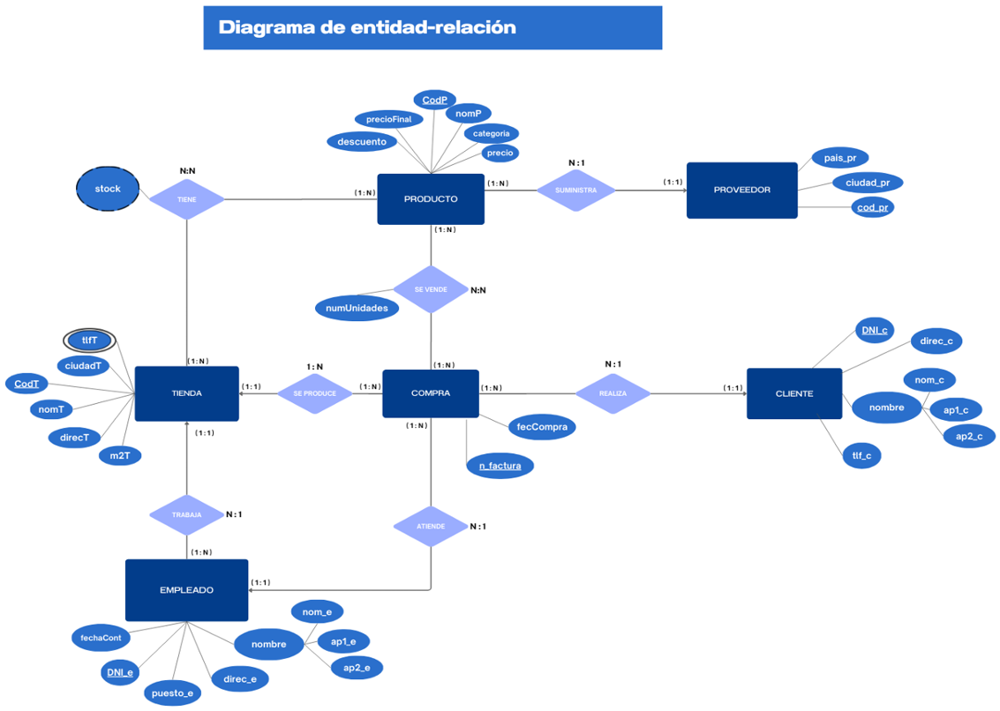

# 🛒 Inditex Database Design and Analysis
 
Academic project (Universidad Complutense de Madrid) for designing and implementing a relational database to manage the operations of an Inditex-style retail company: stores, employees, customers, products, suppliers, and sales.
 
**Authors:** Laura López Rodríguez and Marina Parra Prieto
 
---
 
## 📋 Description
 
The goal is to model and optimize the logistics and commercial management of a fashion retail chain, covering everything from requirements analysis to SQL implementation, including sample data and business queries.
 
The project is structured in 4 phases:
 
1. **Requirements analysis** — identification of entities: Stores, Employees, Customers, Products, Purchases, and Suppliers.
2. **Conceptual design** — Entity-Relationship model (diagram included).
3. **Logical design** — mapping the ER model to relational tables.
4. **Implementation** — database creation in MySQL, triggers, sample data loading, and queries.
## 🗂️ Data Model
 

 
**Main entities:** `Store`, `Employee`, `Customer`, `Product`, `Supplier`, `Purchase`
**N:N relationships with their own table:** `Has` (Store–Product, with derived stock), `IsSoldIn` (Purchase–Product)
 
## ⚙️ Key Technical Features
 
- **Triggers:**
  - `actualizar_stock`: automatically decreases stock when a sale is registered and throws an error if stock is insufficient.
  - `verificar_tienda_empleado`: validates that the employee handling a purchase belongs to the store where it's made.
- **Derived attributes:** `precioFinal` (final price) is automatically calculated from `precio` (price) and `descuento` (discount).
- **Referential integrity:** foreign keys with `ON DELETE CASCADE` / `ON UPDATE CASCADE` where applicable.
## 🔍 Included Queries
 
18 business queries in SQL, including:
- Customer with the highest total spending and the associated store
- Customers with no purchases
- Products supplied exclusively by a specific supplier
- Best-selling product and its supplier
- Bulk updates and deletions of products based on business conditions
## 🛠️ Tech Stack
 
`MySQL` `SQL` `Entity-Relationship Modeling`
 
## 📁 Repository Structure
 
```
├── TRABAJO_INDITEX.sql        # Full script: table creation, triggers, sample data, and queries
├── CONSULTAS_INDITEX.sql      # Business queries only (18 queries)
├── TRABAJO_BASES_INDITEX.pdf  # Report: requirements analysis, conceptual and logical design
└── README.md
```
 
## ▶️ How to Run It
 
1. Open MySQL Workbench (or another MySQL client).
2. Run the full `TRABAJO_INDITEX.sql` script — it creates the database, tables, triggers, and loads the sample data.
3. Run the queries in `CONSULTAS_INDITEX.sql` individually to explore the results.
